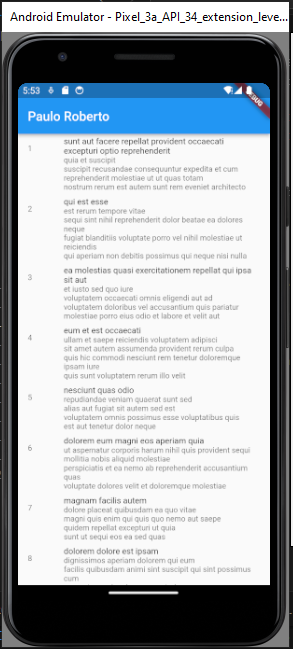

# Avaliação 6 -> Block library
    Esse repositório tem como intuito armazenar os códigos que foram necessários para realização da avaliação 06.
    O professor Ricardo Duarte Taveira instruiu a turma sobre a biblioteca Block e essa avaliação está para mostrar os aprendizados por meio da resolução do problema passado e a elaboração de questões. Ao fim desse README estão as informações do projeto "flutter list" que é fornecido na plataforma da documentação.

## Perguntas elaboradas a pedido do professor:
    1. Explique como o Bloc ajuda na separação de responsabilidades em um aplicativo Flutter. E complemente explicando a importância de tal separação.
        R = O Bloc facilita a separação de responsabilidades ao dividir CLARAMENTE a lógica de negócios da camada de apresentação. A camada de apresentação lida com a interface do usuário, enquanto o Bloc encapsula a lógica de negócios, utilizando Streams para comunicação assíncrona. Essa separação simplifica a manutenção, melhora a escalabilidade, a testabilidade e permite uma colaboração mais eficiente em equipes de desenvolvimento
    
    2. Qual é o papel do diretório bloc no contexto da biblioteca Bloc em Flutter, e por que ele é importante para a organização do código relacionado aos posts?
        R = O diretório bloc tem um papel central ao abrigar a lógica de negócios relacionada aos posts em um aplicativo Flutter. Sua importância reside na separação de responsabilidades, organização estruturada do código, facilitação da testabilidade e integração clara com o uso de Streams para gerenciar a comunicação assíncrona.
    
    3. Quando se trata de mensagens de erro, como o gerenciamento de estado com a biblioteca Bloc pode ser implementado para lidar com essas situações de maneira robusta? Como o Bloc facilita a apresentação de mensagens de erro na interface do usuário e a comunicação eficiente entre a lógica de negócios e a camada de apresentação?
        R = O Bloc na biblioteca Flutter facilita o tratamento robusto de mensagens de erro ao permitir a definição de eventos e estados específicos para erros. Utilizando Streams para comunicação assíncrona, o Bloc notifica a interface do usuário de maneira eficiente, centralizando o tratamento de erros na lógica de negócios. Isso resulta em uma apresentação consistente de mensagens de erro, melhorando a testabilidade e a manutenção do código.

## Estrutura de pastas da APP:

├──lib
├── posts
│   ├── bloc
│   │   └── post_bloc.dart
│   │   └── post_event.dart
│   │   └── post_state.dart
│   ├── models
│   │   └── models.dart
│   │   └── post.dart
│   ├── view
│   |   └── posts_list.dart
│   |   └── posts_page.dart
│   |   └── view.dart
|   ├── widgets
│   |   └── bottom_loader.dart
│   |   └── post_list_item.dart
│   |   └── widgets.dart
│   └── posts.dart
├── app.dart
├── main.dart
└── simple_bloc_observer.dart
pubspec.lock
pubspec.yaml

**A estrutura do projeto feita anteriormente refere-se apenas à pasta "lib" que foi modificada/analisada para resolução da avaliação**

## Dados que são tratados pelo Gerenciamento de Estado:

* Entrada do usuário (scrolling)
* Dados das postagens
* Mensagens de erro.

## Print do simulador com nome do aluno:

## flutter_list

A new Flutter project.

### Getting Started

This project is a starting point for a Flutter application.

A few resources to get you started if this is your first Flutter project:

- [Lab: Write your first Flutter app](https://docs.flutter.dev/get-started/codelab)
- [Cookbook: Useful Flutter samples](https://docs.flutter.dev/cookbook)

For help getting started with Flutter development, view the
[online documentation](https://docs.flutter.dev/), which offers tutorials,
samples, guidance on mobile development, and a full API reference.
