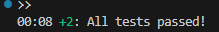

## Avaliação 9 -> Mokito Package
Esse repositório tem como intuito armazenar os códigos que foram necessários para realização da avaliação 09.
O professor Ricardo Duarte Taveira instruiu a turma sobre o funcionamento e a importância da utilização de 
testes unitários e a utilização do pacote Mokito.

## Print do simulador com o nome do aluno:

